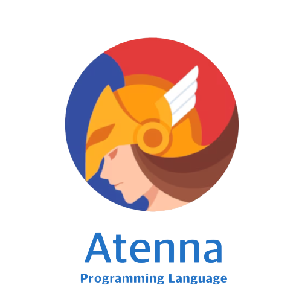

# Atenna Programming Language
### Developed by Gabriel Margarido - Version 0.2.5
A compiled, multiplatform, statically, structured and strongly-typed programming language with a Java-like syntax and a bit of Javascript semantics. That ables you to code instantly fast programs and execute them on LLVM (low-level virtual machine).

<br>

Atenna source-files extensions are: `*.atenna` or `*.atn` 

## Install Git Bash (Windows)


Download for Windows: [Git Bash](https://git-scm.com/download/win)  
_It emulates a UNIX-like environment_


## Install Atenna on Microsoft VSCode


**Note: "sudo" is required**  
Compile & Install AtennaC and Microsoft VSCode extension from sources using:  
`make install-atenna install-vscode-support VSCODE_EXT=.vscode`  

Uninstall AtennaC and Microsoft VSCode extension with:  
`make uninstall-atenna uninstall-vscode-support VSCODE_EXT=.vscode`  

## Install Atenna on VSCodium (VSCode OSS)


**Note: "sudo" is required**   
Compile & Install AtennaC and VSCodium extension from sources using:  
`make install-atenna install-vscode-support VSCODE_EXT=.vscode-oss`  

Uninstall AtennaC and VSCode extension with:  
`make uninstall-atenna uninstall-vscode-support VSCODE_EXT=.vscode-oss`  


## Fixing cache errors on compilation target
**Note: "sudo" is required**   
Reset AtennaC target caches using:  
`make reset-cache`  


## AtennaC - Atenna Compiler
### Folder Data
V Middle-end cache folder on UNIX: `/opt/atenna-cache`  
AtennaC libraries folder on UNIX: `/usr/local/bin/atenna-libs`


### Compile programs on AtennaC
Help manpage: `sudo atennac --help`  
Compile to binary: `sudo atennac <file>.atn -o <file>`  
Compile to library module: `sudo atennac <file>.atn -lib-module <file>`
    
View AST - Abstract Syntax Tree: `sudo atennac <file>.atn -ast`  

### Basic program structure
```
package main
# import os

private void function main() {
    System.out.println("Hello world")
}
```

### Creating functions and returning values
```
package main
# import os

public int function calculate(x int, y int) {
    return x+y
}

private void function main() {
    let r = calculate(5, 20)
    System.out.println("Result: "+r)
}
```

### Importing modules
```
import os
import db.mysql
```

### Single-line Comments
```
# There is a comment here
```  

### Creating modules and importing them
**mymodule.atenna**
```
package mymodule

public void function say_hello(person string) {
    System.out.println("Hello ${person}!")
}
```
*Compile with: `sudo atennac mymodule.atenna -lib-module mymodule`*  
It's going to create a folder named `mymodule` with `mymodule.v` library file inside it.
  

**main.atenna**
```
package main
import mymodule

private void function main() {
    mymodule.say_hello("John Backus")
}
```
*Compile with: `sudo atennac main.atenna -o main`*  
It's going to compile to an executable `main` file with `mymodule` module included.  

Run `main` executable program with `./main`


### Primitive types

Integer 8-bit: `i8`  
Integer 16-bit: `i16`  
Integer 32-bit: `int`  
Integer 64-bit: `i64`  

Unsigned integer 8-bit: `u8`  
Unsigned integer 16-bit: `u16`  
Unsigned integer 32-bit: `u32`  
Unsigned integer 64-bit: `u64`  

Unicode string: `rune`  
ASCII string: `string` 

Float 32-bit: `float32` or `f32`  
Float 64-bit: `float64` or `f64`  

Boolean: `bool`  
Void (don't return anything): `void` 


### Variables Initialization and Reassignment (type inference)
```
let x = 3
let x = 3.45
let x = "Hello world"
let x = true

x = 4
x = 4.56
x = "Bye world"
x = false
```

### Arrays Initialization (type inference) - They cannot be reassigned
```
let x[] = (0, 2, 3, 8, 16, 32, 64, 128, 256, 512)
let x[] = (0.45, 2.36, 3.12, 8.07, 16.89, 32.04, 64.067, 128.456, 256.45, 512.028)

let x[] = ("Juliana Kay", "Will Nored", "Evelyn Spielberg")
let x[] = (true, false, true)
```

### Private functions
```
private void function my_func() {
        # TODO CODE HERE

}

private int function my_func() {
        # TODO CODE HERE
    
    return ...
}
private float32 function my_func() {
        # TODO CODE HERE - 32-bit FLOAT

    return ...
}
private float64 function my_func() {
        # TODO CODE HERE - 64-bit FLOAT

    return ...
}

private string function my_func() {
        # TODO CODE HERE - STRING

    return ...
}

private bool function my_func() {
        # TODO CODE HERE - BOOL

    return ...
}

```

### Public functions
```
public void function my_func() {
        # TODO CODE HERE

}

public int function my_func() {
        # TODO CODE HERE
    
    return ...
}
public float32 function my_func() {
        # TODO CODE HERE - 32-bit FLOAT

    return ...
}
public float64 function my_func() {
        # TODO CODE HERE - 64-bit FLOAT

    return ...
}

public string function my_func() {
        # TODO CODE HERE - STRING

    return ...
}

public bool function my_func() {
        # TODO CODE HERE - BOOL

    return ...
}

```


### If-Else-Elseif

```
# Variable declaration
let max = 2


# Conditionals
if (max > 5) {

} else {

}
```

```
# Variable declaration
let min = 7
let max = 45


# Conditionals
if (min < 3) {

} elseif (max > 5) {

} else {

}
```

### For/While

**From 0 to 5**
```
for i in (0..5) {
    System.out.println(i)
}
```

**Iterate over an array**
```
let numbers[] = (15, 20, 25, 30, 35, 40)

for i in (numbers) {
    System.out.println(i)
}
```

**Making a for using while**
```
let c = 0

while (c < 10) {
    System.out.println(c)
    c = c+1
}
```

**Infinity loop**
```
while (true) {
    # INFINITY LOOP
}
```

**Input & Output:**
*`import os`*  is required for `System.in` method.  
```
package main
import os

private void function main() {
    let answer = System.in("What is your name? ")
    System.out.println("Hello, ${answer}")
}
```

**Password Input**
*`import os`*  is required for `System.in.password` method.  
```
package main
import os

private void function main() {
    let password = System.in.password("What is your password? ")
    System.out.println("Your password is: ${password}")
}
```

**CLI Args:**
*`import os`*  is required for CLI Args. 
```
package main
import os

private void function main() {
    let args = os.args

    for i in (args) {
        System.out.println("Argument: ${args[i]}")
    }
}
```

## Enums/Classes - `enum`
### Enums - Mutable
```
enum Person {
    def age int
    def height float64
    def name string
    def surname string
}

let gabriel = new Person(18, "Gabriel", "Margarido")
```


### Enums - Immutable
```
enum Person {
    def age int
    def height float64
    def name string
    def surname string
}

const gabriel = new Person(18, "Gabriel", "Margarido")
```

# String Handling
### String Handling - Split beginning by each uppercase/capital letter [A-Z] - `str.split_capital(string)`
```
package main
# import os

private void function main() {
    let str = "SarahSheevaAlanKay"
    let result = strings.split_capital(str)

    for i in (str) {
        System.out.println(str[i])
    }
    
}  
```

### Get string length - `str.len`
```
package main
# import os

private void function main() {
    let str = "SarahSheevaAlanKay"
    let length = str.len

    System.out.println(length)
}  
```

### Replace one string by another - `str.replace`
```
package main
# import os

private void function main() {
    let str = "Hello world"
    let next = str.replace("Hello", "Bye")

    System.out.println(next)
}  
```

### Split string - `str.split`
```
package main
# import os

private void function main() {
    let str = "Hello world"
    let splitted = str.split(" ")

    System.out.println(splitted)
}  
```

### Extract substring - `str.substr`
```
package main
# import os

private void function main() {
    let str = "Hello world"
    let substring = str.substr(4,-2)

    System.out.println(substring)
}  
```

### String contains another - `str.contains`
```
package main
# import os

private void function main() {
    let str = "Hello world"
    let another = str.contains("world")

    System.out.println(another)
}  
```

### String to lowercase - `str.to_lower`
```
package main
# import os

private void function main() {
    let str = "HELLO WORLD"
    System.out.println(str.to_lower())
}  
```

### String to uppercase - `str.to_upper`
```
package main
# import os

private void function main() {
    let str = "hello world"
    System.out.println(str.to_upper())
}  
```

### Find string between delimiters - `str.find_between`
```
package main
# import os

private void function main() {
    let str = "hello world to [you and all people]"
    let x = str.find_between("[", "]")
    
    System.out.println(x)
}  
```


# File System Library
### Verify if file or directory exists - `os.exists`
```
package main
import os

private void function main() {
    if (os.exists("test.txt")) {
        System.out.println("Yes, it exists")
    }
}  
```

### Verify if file or directory exists in $PATH - `os.exists_in_system_path`
```
package main
import os

private void function main() {
    if (os.exists_in_system_path("test.txt")) {
        System.out.println("Yes, it exists in PATH")
    }
}  
```

### Change file or folder permissions (Octal) - `os.chmod`
```
package main
import os

private void function main() {
    let perm = 0o600
    os.chmod("test.txt", perm)
}  
```

### Change file or folder group - `os.chown(file, owner, group)`
```
package main
import os

private void function main() {
    let owner = "gabrielmargarido"
    let group = "staff"
    os.chown("test.txt", owner, group)
}  
```

### Copy folder or directory - `os.cp(origin, destination)`
```
package main
import os

private void function main() {
    os.cp("test.txt", "copied_test.txt")
}  
```

### Copy folder or directory (Recursively) - `os.cp_all(origin, destination, overwrite)`
```
package main
import os

private void function main() {
    os.cp_all("test.txt", "copied_test.txt", true)
}  
```

### Run Shell Comamnd (get output) - `os.execute(command)`
```
package main
import os

private void function main() {
    # Run command
    os.execute("ls -lha")

    # Get return output from command
    let x = os.execute("ls")
}  
```

### Run Shell Comamnd (get code) - `os.system(command)`
```
package main
import os

private void function main() {
    # Run command
    os.system("ls -lha")

    # Get return code from command
    let x = os.system("ls")
}  
```

### Get extension from file - `os.file_ext(filename)`
```
package main
import os

private void function main() {
    let ext = os.file_ext("file.c")
    System.out.println(ext)
}  
```

### Get name of file from path - `os.file_name(filename)`
```
package main
import os

private void function main() {
    let fname = os.file_name("file.c")
    System.out.println(fname)
}  
```

### Get file size - `os.file_size(filename)`
```
package main
import os

private void function main() {
    let fsize = os.file_size("file.c")
    System.out.println(fsize)
}  
```

### Get full path of executable file - `os.find_abs_path_of_executable(filename)`
```
package main
import os

private void function main() {
    let full = os.find_abs_path_of_executable("file.c")
    System.out.println(full)
}  
```

### Get current directory full path - `os.getwd()`
```
package main
import os

private void function main() {
    let cwd = os.getwd()
    System.out.println(cwd)
}  
```

### Get name of /home/... ($HOME) - `os.home_dir()`
```
package main
import os

private void function main() {
    let home = os.home_dir()
    System.out.println(home)
}  
```

### Is directory empty? - `os.is_dir_empty(path)`
```
package main
import os

private void function main() {
    let dir = os.is_dir_empty("myfolder/images")
    System.out.println(dir)
}  
```

### Is executable - `os.is_executable(path)`
```
package main
import os

private void function main() {
    let exec = os.is_executable("app.exe")
    System.out.println(exec)
}  
```

### Is a file - `os.is_file(path)`
```
package main
import os

private void function main() {
    let isfile = os.is_file("app.exe")
    System.out.println(isfile)
}  
```

### Is a symlink - `os.is_link(path)`
```
package main
import os

private void function main() {
    let islink = os.is_link("htdocs")
    System.out.println(islink)
}  
```

### Create symlink - `os.link(origin, target)`
```
package main
import os

private void function main() {
    os.link("~/Documents", "~/Desktop/MyDoc")
}  
```

### Create folder - `os.mkdir(path)`
```
package main
import os

private void function main() {
    os.mkdir("myfolder")
}  
```

### Move folder - `os.mv(origin, target)`
```
package main
import os

private void function main() {
    os.mv("myfolder", "youfolder")
}  
```

### Remove folder - `os.rmdir(path)`
```
package main
import os

private void function main() {
    os.rmdir("myfolder")
}  
```

### Remove file - `os.rm(path)`
```
package main
import os

private void function main() {
    os.rm("myfile")
}  
```


# Write & Read Files
### Write/Overwrite - `os.write_file`
```
package main
import os

private void function main() {
    os.write_file("MyFile.txt", "Hello World!\n")
}  
```

### Read - `os.read_file`
```
package main
import os

private void function main() {
    let filereader = os.read_file("MyFile.txt")
    System.out.println(filereader)
}  
```

### Readlines - `os.read_lines`
```
package main
import os

private void function main() {
    let filereader = os.read_lines("MyFile.txt")

    for line in (filereader) {
       System.out.println(filereader[line]) 
    }
}  
```

### Append - `Mix`
```
package main
import os

private void function main() {
    # Read all temporary
    let read = os.read_file("MyFile.txt")
    let writable_message = "Plus a message\n"

    # Write all - append
    os.write_file(read+writable_message)
}  
```

# Operating System Library
### Get Uname - `os.uname()`
```
package main
import os

private void function main() {
    let uname = os.uname()
    System.out.println(uname)
}  
```

### Get OS Name - `os.user_os()`
```
package main
import os

private void function main() {
    let UserOS = os.user_os()
    System.out.println(UserOS)
}  
```

### Get all usernames in OS - `os.user_names()`
```
package main
import os

private void function main() {
    let usernames = os.user_names()

    for i in (usernames) {
        System.out.println(usernames[i])
    }
    
}  
```